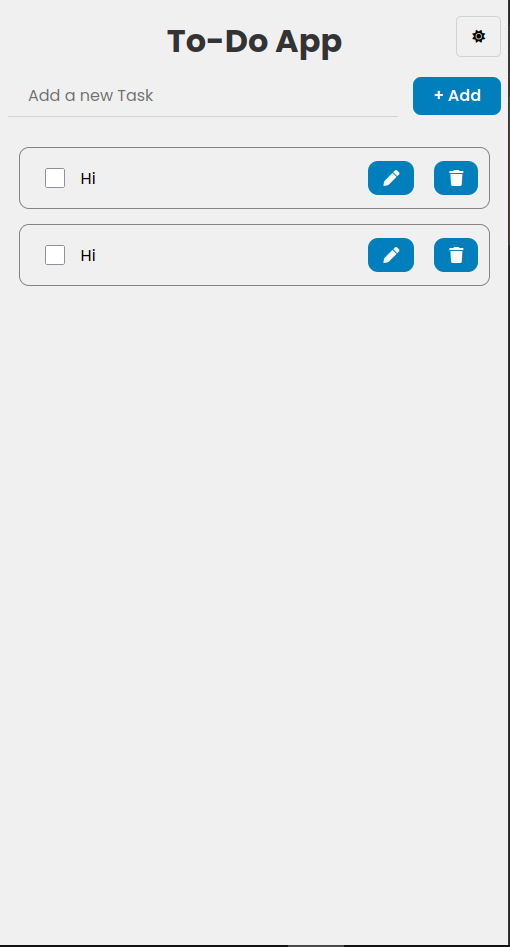

# To-Do App

A simple, modern to-do list web app built with vanilla JavaScript, modern CSS, and Vite.  
Stay organized, track your daily tasks, and enjoy a clean, responsive interface with dark mode!

## Features

- **Add Tasks:** Quickly add new tasks with the input field and add button.
- **Task Persistence:** Tasks are stored in your browser's localStorage.
- **Edit & Delete:** Edit or delete individual tasks.
- **Mark Complete:** Checkbox to mark tasks as complete/incomplete.
- **Responsive Design:** Works great on desktop and mobile screens.
- **Dark Mode:** Toggle dark mode for comfortable viewing.
- **Keyboard Shortcuts:** Add tasks with the Enter key.
- **Modern UI:** Built with Poppins font and FontAwesome icons.

## Demo



## Getting Started

### Prerequisites

- [Node.js](https://nodejs.org/) (v14 or higher recommended)
- [npm](https://www.npmjs.com/) or [yarn](https://yarnpkg.com/)

### Installation

1. **Clone the repository:**
   ```bash
   git clone https://github.com/Manpreet055/To-do-App.git
   cd To-do-App
   ```
2. **Install dependencies:**
   ```bash
   npm install
   # or
   yarn install
   ```
3. **Start the development server:**
   ```bash
   npm run dev
   # or
   yarn dev
   ```
4. **Open the app:**
   The app will open automatically in your browser at `http://localhost:5173` (or the port shown in your terminal).

## Project Structure

```
.
├── index.html
├── style.css
├── script.js
├── package.json
├── vite.config.js
├── utils/
│   ├── addTask.js
│   ├── deleteTask.js
│   ├── darkMode.js
│   └── eventListener.js
└── ...
```

- `index.html` - Main HTML layout.
- `style.css` - Custom CSS (including dark mode).
- `script.js` - Main task logic, imports modular utilities.
- `utils/` - Reusable JS modules for app features.
- `vite.config.js` - Vite build settings.

## Scripts

- `npm run dev` - Start local dev server with Vite.
- `npm run format` - Format code with Prettier.
- `npm run lint` - Lint code with ESLint.

## Customization

- Customize styles in `style.css`.
- Extend features via additional modules in `utils/`.

## License

This project is licensed under the ISC License.

---

_Made with ❤️ by [Manpreet055](https://github.com/Manpreet055)_
